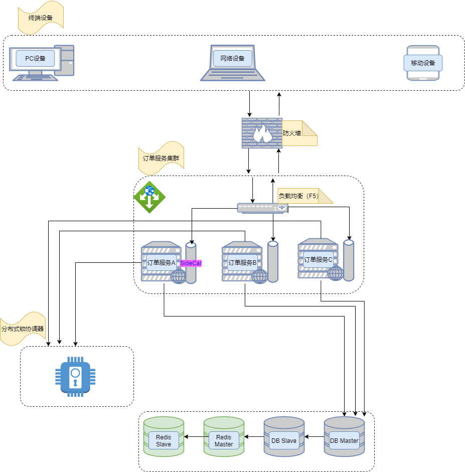
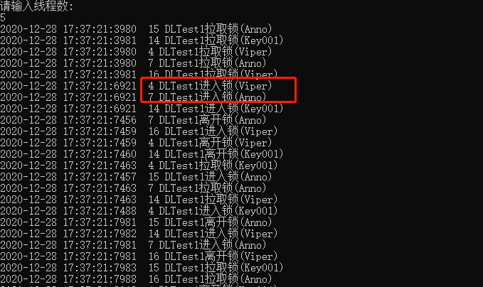

####9.4 分布式锁
##### 9.4.1、什么是锁
<strong>锁</strong>是为了解决多线程或者多进程资源竞争的问题。

　　同一进程的多个线程资源竞争可以用lock解决。
　　lock 关键字可确保当一个线程位于代码的临界区时，另一个线程不会进入该临界区。 如果其他线程尝试进入锁定的代码，则它将一直等待（即被阻止），直到该对象被释放。
 ```csharp
 class Test  
{  
    //定义一个私有成员变量，用于Lock  
    private static object lockobj = new object();  
    void DoSomething()  
    {  
        lock (lockobj)  
        {  
            //需要锁定的代码块  
        }  
    }  
}
 ```
 多进程之间解决资源竞争问题我们则需要引入分布式锁。通过一个协调者来解决，通常的解决办法是通过redis来解决，这里不展开redis分布式锁的讨论。　接下来我们来聊聊如何自己实现一个分布式锁（不依赖于redis）。
 #### 9.4.2、分布式锁是个什么？
 分布式锁是分布式、微服务中一个必然要讨论的话题。他为的是解决多进程多线程资源竞争的问题。
  
 
下面我们以订单系统下单扣减库存为例聊一聊扣减库存的问题。
    三个客户KA、KB、KC同时下单购买物品P1，请求通过负载均衡器分发到订单服务A、订单服务B、订单服务C。这个时候三个服务同时要对数据库中的P1物品判断库存是否充足。假设库存剩余10个，KA需要购买6个、KB需要购买6个、KC需要购买6个。

　　正常情况下服务A、B、C都查询了库存大于购买的数量，那么三个服务都判断可以下单。此时我们可以看到，她们都进行下单明显剩余库存不足18个，那么就会出现超卖的问题。那我们怎么办。我们第一时间会想到锁，不过在分布式环境下程序自带的Lock已经不能解决我们的问题。
　　消息队列也可以解决这个问题，不过这里我们不讨论，我们要讨论的是用锁来解决。
这个时候我们需要一个协调者来协调三个服务同时只能有一个请求进入下单代码块。原理同本地锁一样（当一个线程位于代码的临界区时，另一个线程不会进入该临界区。 如果其他线程尝试进入锁定的代码，则它将一直等待（即被阻止），直到该对象被释放）。另外我们还需要注意的是，如果锁的拥有者出现问题，不能及时释放锁。那么就会导致其他服务一直等待。那么就会出现死锁的问题，因此我们也必须一如超时机制。在我们预设的处理时间内不能释放锁则需要协调者自动释放锁。防止出现死锁。
 ####9.4.3 Anno实现分布式锁
 
 ```csharp
 using System;
using System.Collections.Generic;
using System.Text;
using System.Threading.Tasks;


namespace ConsoleTest
{
    using Anno.Const;
    using Anno.EngineData;
    using Anno.Loader;
    using Anno.Rpc.Client;
    using Anno.Rpc.Server;
    using Autofac;

    public class DLockTest
    {
        public void Handle()
        {
            Init();
        To:
            List<Task> ts = new List<Task>();
            Console.WriteLine("请输入线程数:");
            int.TryParse(Console.ReadLine(), out int n);
            for (int i = 0; i < n; i++)
            {
                var task = Task.Factory.StartNew(() => { DLTest1("Anno"); });
                ts.Add(task);
                //var taskXX = Task.Factory.StartNew(() => { DLTest1("Viper"); });
                //ts.Add(taskXX);

                //var taskJJ = Task.Factory.StartNew(() => { DLTest1("Key001"); });
                //ts.Add(taskJJ);
            }

            Task.WaitAll(ts.ToArray());
            goto To;
        }

        private void DLTest1(string lk = "duyanming")
        {
            try
            {
                Console.WriteLine($"{DateTime.Now:yyyy-MM-dd HH:mm:ss:ffff}  {System.Threading.Thread.CurrentThread.ManagedThreadId} DLTest1拉取锁({lk})");
                using (DLock dLock = new DLock(lk, 10000))
                {
                    Console.WriteLine($"{DateTime.Now:yyyy-MM-dd HH:mm:ss:ffff}  {System.Threading.Thread.CurrentThread.ManagedThreadId} DLTest1进入锁({lk})");
                    System.Threading.Thread.Sleep(50);
                }

                Console.WriteLine($"{DateTime.Now:yyyy-MM-dd HH:mm:ss:ffff}  {System.Threading.Thread.CurrentThread.ManagedThreadId} DLTest1离开锁({lk})");
            }
            catch (Exception e)
            {
                Console.WriteLine(e.Message);
            }
            
        }
        void Init()
        {
            //SettingService.AppName = "DLockTest";
            //SettingService.Local.IpAddress = "127.0.0.1";
            //SettingService.Local.Port = 6660;

            IocLoader.GetAutoFacContainerBuilder().RegisterType(typeof(RpcConnectorImpl)).As(typeof(IRpcConnector)).SingleInstance();
            IocLoader.Build();
            DefaultConfigManager.SetDefaultConnectionPool(100, Environment.ProcessorCount * 2, 50);
            DefaultConfigManager.SetDefaultConfiguration("DLockTest", "127.0.0.1", 6660, false);
        }
    }
}
 ```
  
 
 不同类型的锁可以同时进入相互不影响
 ```csharp
 var task = Task.Factory.StartNew(() => { DLTest1("Anno"); });
                ts.Add(task);
                var taskXX = Task.Factory.StartNew(() => { DLTest1("Viper"); });
                ts.Add(taskXX);

                var taskJJ = Task.Factory.StartNew(() => { DLTest1("Key001"); });
                ts.Add(taskJJ);
 ```
  
 
 上图我们开了12个进程同时进入DLTest1 方法，
 
 ```csharp
 using (DLock dLock = new DLock(lk, 10000))设置超时时间10秒。
 private void DLTest1(string lk = "duyanming")
        {
            try
            {
                Console.WriteLine($"{DateTime.Now:yyyy-MM-dd HH:mm:ss:ffff}  {System.Threading.Thread.CurrentThread.ManagedThreadId} DLTest1拉取锁({lk})");
                using (DLock dLock = new DLock(lk, 10000))
                {
                    Console.WriteLine($"{DateTime.Now:yyyy-MM-dd HH:mm:ss:ffff}  {System.Threading.Thread.CurrentThread.ManagedThreadId} DLTest1进入锁({lk})");
                    System.Threading.Thread.Sleep(50);
                }

                Console.WriteLine($"{DateTime.Now:yyyy-MM-dd HH:mm:ss:ffff}  {System.Threading.Thread.CurrentThread.ManagedThreadId} DLTest1离开锁({lk})");
            }
            catch (Exception e)
            {
                Console.WriteLine(e.Message);
            }
        }
 ```
 
 
 
 :::tip 分布式锁的测试链接

https://github.com/duyanming/Anno.Core/blob/master/test/ConsoleTest/DLockTest.cs 
freeredis 实现的分布式锁:https://www.cnblogs.com/hellotim/p/14513000.html
 :::
 